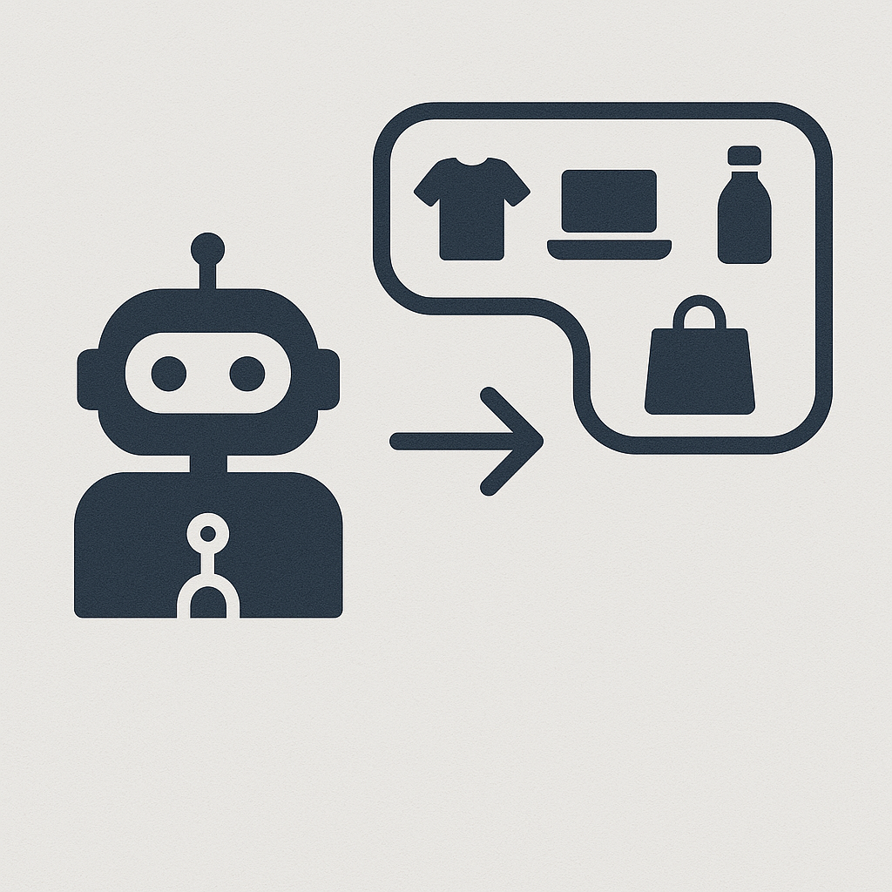

# Recommender System

This was a challenge of the BOOST HACKHATON organized by INDITEX. The goal of this project is to design a recommender system for an e-commerce retailer. First, we had to analyze the data of the customer's organization in order to understand what kind of products they buy according to their preferences. For this task, there are three datasets that I have used. Their sizes are too large to upload to GitHub. So , we will provide you the URL of these objects  from our AWS bucket:

* [Users](https://cfolstorage.s3.eu-west-3.amazonaws.com/data_recommender_system/users.csv) [17 MB]: Customers's information. To gather this data we had to design an script (`scripts/users_api.py`) to automate the sending of requests to the API that they provide us.
    * [K-means]()[14 KB]: The file containing the results when the K-means algorithm in order to reduce the computing time required to reproduce the experiment.

* [Products](https://cfolstorage.s3.eu-west-3.amazonaws.com/data_recommender_system/products.pkl) [186 MB]: The list of products that the organization sells.
    * [Embeddings](https://cfolstorage.s3.eu-west-3.amazonaws.com/data_recommender_system/embeddings.csv) [582 MB]: The embeddings of the product's flat image obtained from computer vision techniques.

* [Train](https://cfolstorage.s3.eu-west-3.amazonaws.com/data_recommender_system/train.parquet) [605 MB]: The training data that we have used to design this system.

> [!NOTE]
> The development of the model is in progess...

